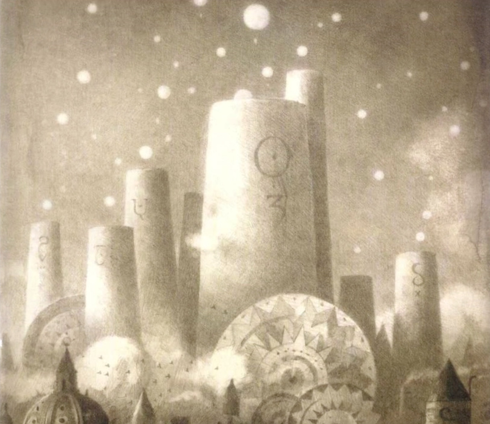
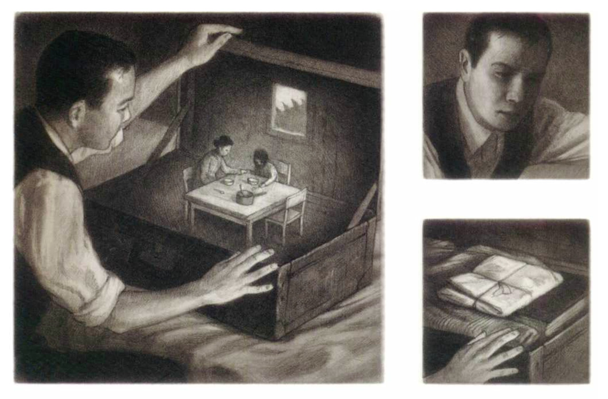
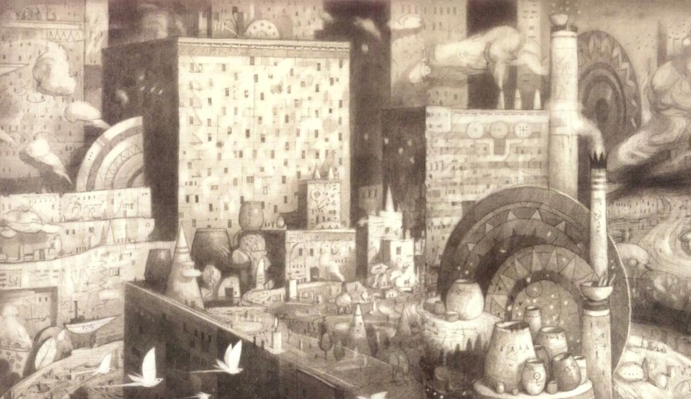
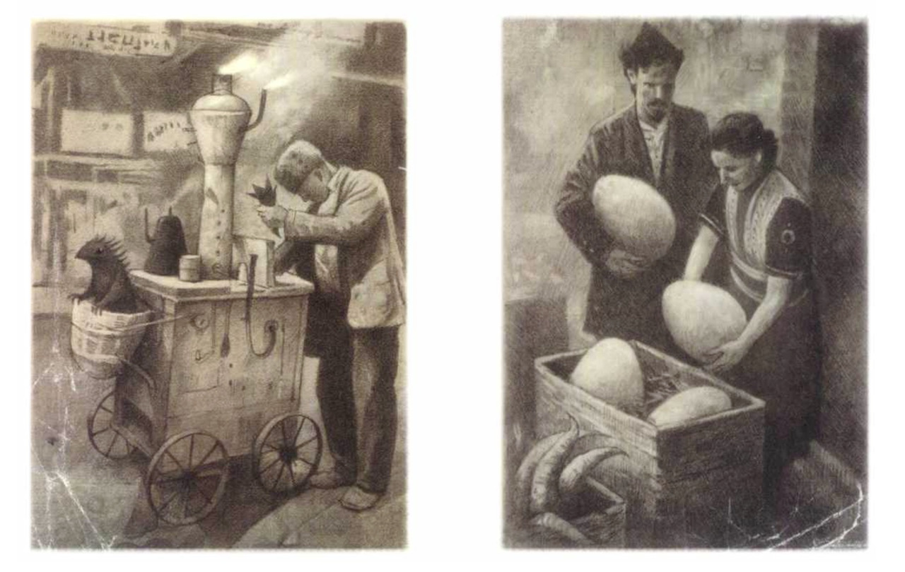

This is short animation featuring artwork from the third chapter of Shaun Tan's graphic novel, The Arrival - [shauntan.net](http://shauntan.net)

I have created sound and music for the book, hoping to add movement and depth to the images. I aimed to create a soundtrack that is reflective of the book's visual style and shows the world from the character's point of view.

The book tells a story of a man who leaves his wife and child in an impoverished town, seeking better prospects in an unknown country on the other side of a vast ocean. He eventually finds himself in a bewildering city of foreign customs, peculiar animals, curious floating objects and indecipherable languages.

Sound used is both my own field recording and foley work as well as sound libraries from [freesound.org](http://freesound.org), [stephanschutze.com](http://stephanschutze.com) and [hissandaroar.com](http://hissandaroar.com).

  

    <iframe src="https://player.vimeo.com/video/36180836" width="640" height="360" frameborder="0" webkitallowfullscreen mozallowfullscreen allowfullscreen></iframe>
  

